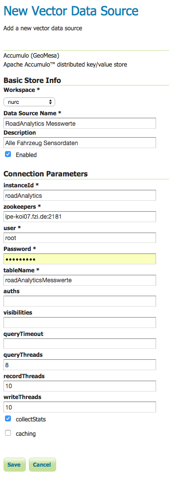
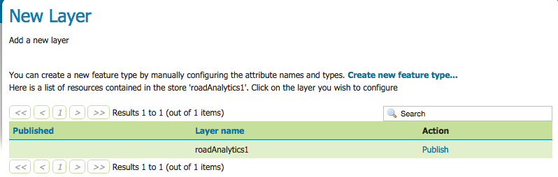
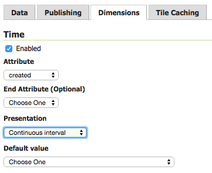
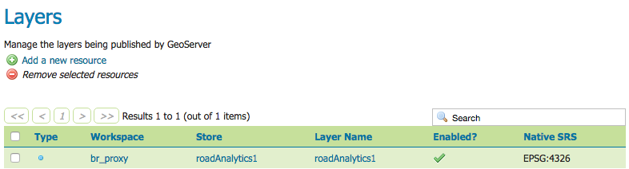

## Geoserver Docker-Image for GeoMesa

This Container contains:

  * GeoServer 2.8.2
  * WPS-Plugin
  * GeoMesa Extension (checkout the [GeoMesa Tutorial](http://www.geomesa.org/documentation/test-readthedocs/tutorials/geomesa-quickstart-accumulo.html#visualize-data-with-geoserver))

Developed for:

* geomesa 1.2.0
* accumulo 1.6.2
* hadoop 2.7.2
* thrift 0.9.1
* zookeeper 3.4.5

### Creating the Image

```sh
docker build -t fzi/geoserver .
```

### Run the Container

``` sh
docker run --name "geoserver" --link master1:master1.gt -p 8082:8080 -d -t fzi/geoserver
```

**Note:** The server needs a couple of minutes to startup. You can check it's status with `docker logs geoserver`

**Note:** The default geoserver user is 'admin' and the password is 'geoserver'.

### Nutzung eines Data-Only Containers

Dockerfiles shall be modular, which is why it is a good design to seperature data and functionality. Therefore Docker suggests the usage of [data-only containers](https://docs.docker.com/engine/userguide/containers/dockervolumes). The following commands will setup a data-only container and link the geoserver data directory to this container, so that all relevant data are not stored within the geoserver container but in the geoserver_data container.

``` sh
docker run --name geoserver_data -v /var/lib/geoserver:/opt/geoserver/data_dir busybox
docker run --name "geoserver" --link master1:master1.gt -p 8082:8080 -d --volumes-from geoserver_data -t fzi/geoserver
```

### Configuring a WFS

1. After the startup Geoserver is available at `your.host:8082/geoserver/web/`. Login using your credentials.

2. Create a new DataStore using `Stores > Add new Store > Accumulo (GeoMesa)`.

3. Enter the Connection Details for your Database as well as the Table you want to build the WFS on, then Submit the page.

  

4. On the next page you should see the created Store. Click 'Publish'.

  

5. On the *Edit Layer* page you can do many modifications. You will at least need to fill the Bounding Boxes using the 'Compute from data' / 'Compute form native bounds' Links. 

  If you also want to create a WMS with time filter you will need to go at the third tab 'Dimensions'. There you first enable the Time, then select the Attribute you want to filter by. You also need to choose a presentation format, pick `continuous interval` to filter entries by beginning and ending date/time.
  

  
  
6. After saving the layer you will see an overview of the created Layer. You now can access the layer as well as its WFS/WMS Functionalities using 'Layer Preview'

  

### Use WFS
OpenLayers

JSONP

Heatmap